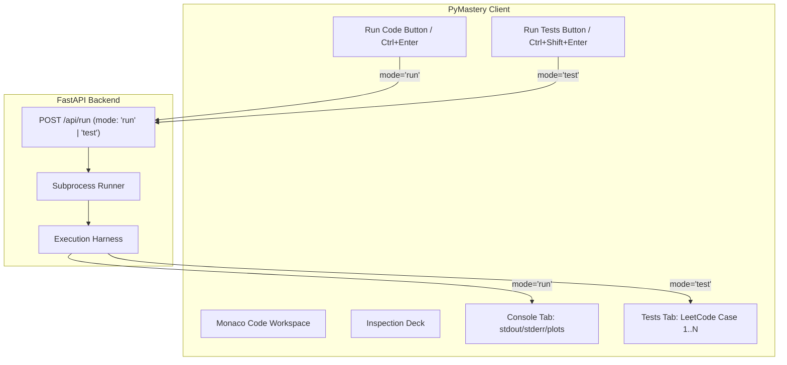

# PyMastery Comprehensive Architecture & Design Specification

**Target Branch**: `pymastery-issue-solutions`  
**Status**: Validated & Approved Design  
**Date**: September 2026  

---

## 1. Executive Summary & Purpose

PyMastery is an interactive browser-based studio designed for experienced engineers and data scientists to rapidly master the Python scientific and machine learning stack. 

This specification resolves all 9 reported issues across four core domains:
1. **Execution & Test Deck UX (Issues 4, 5, 8, 9)**: Separating "Run Code" from test assertions, introducing an interactive LeetCode-style test deck, eliminating `None` return values, and displaying full unclipped stack traces.
2. **Authentication & Multi-Device Sync (Issues 2, 3)**: Disentangling Account Sign-In from JSON Sync, adding a direct Sign-Out action, and synchronizing user drafts/progress across devices via JWT.
3. **Curriculum Progression (Issue 1)**: Adding a dual-placement "Next Problem →" action with automatic progression across challenges, parts, and library tracks.
4. **Curriculum Content & Markdown Rendering (Issues 6, 7)**: Sanitizing leaked solution code in problem statements into progressive hints, upgrading inline markdown parsing (italics, bold, code, math), and auditing all curriculum tracks with subagents.

---

## 2. Decision Log

| Area | Decision | Alternatives Considered | Rationale |
| :--- | :--- | :--- | :--- |
| **Scope** | All 9 issues addressed in a unified design. | Phased approach (tests first, auth later). | Issues are tightly coupled in the user experience; a unified plan avoids repeated UI refactors. |
| **Branch Isolation** | All work performed on branch `pymastery-issue-solutions`. | Working directly on `main`. | Preserves clean release management and safe review before merging. |
| **Execution & Test UX** | Strict separation: "Run Code" (sandbox console) vs "Run Tests" (LeetCode tabbed deck). | Single merged action or unified vertical list. | Matches standard competitive programming expectations (LeetCode/HackerRank); prevents false test failures during exploratory coding. |
| **Test Output Capture** | Intercept `candidate_func(*args)` return value directly in runner harness before assertions. | Client-side string scraping or AST instrumentation. | Solves the root cause of `actual: None` without brittle regex on stdout. |
| **Auth & Sync** | Single modal defaulting to Account Login/Register, with a secondary tab for 1-Click Sync Key & JSON backup. | Separate disconnected modals or removing JSON sync. | Restores broken "Sign In" flow while preserving offline backup capabilities. |
| **Sign Out & Multi-Device** | Interactive User Badge with one-click Sign Out and automatic state hydration via `/api/user/state`. | Local-only mode or manual sync key entry on every device. | Provides standard modern web app authentication across multiple workstations. |
| **Navigation** | Dual placement (celebration banner + bottom bar) with hierarchical progression across parts. | Header chevron links or modal popups. | Highly visible upon completion; eliminates need to open curriculum drawer between exercises. |
| **Hints & Content** | Rewrite problem descriptions to conceptual specs; migrate code syntax to hints; run subagent audits. | Leaving hints in description or minimal string deletions. | Preserves pedagogical rigor so students solve challenges through active recall rather than copying syntax. |
| **Markdown Renderer** | Upgrade regex parser to handle `*italic*`, `_italic_`, `**bold**`, code, and KaTeX math. | Heavy third-party markdown engine swap. | Lightweight, zero-dependency enhancement with no risk of breaking existing LaTeX/math rendering. |

---

## 3. Detailed Component Architecture & Data Flow

### 3.1 Code Execution & Test Deck Engine (Issues 4, 5, 8, 9)



#### A. Backend Changes (`server/runner.py`, `server/main.py`)
1. **Mode-Specific Execution Paths**:
   - `mode == "run"`: Compiles and executes code in sandbox namespace. Gathers stdout, stderr, plots, and data summaries. Explicitly sets `test_results = []` and `tests_summary = None`.
   - `mode == "test"`: Pre-compiles user code, then runs test cases.
2. **Accurate Value Capture (Eliminating `None`)**:
   - In `runner.py`, inspect `candidate_func`:
     ```python
     actual_val = candidate_func(*args)
     actual_repr = _safe_repr(actual_val)
     # Evaluate assertion against expected
     ```
   - Stores `actual_repr` directly into the result dictionary.
3. **Full Unclipped Tracebacks**:
   - When an exception or `AssertionError` occurs, captures `traceback.format_exc()` without truncating.
4. **Input Argument Serialization**:
   - Each test result includes `input_repr` detailing arguments passed (e.g. `grid shape: (6, 6), step: 2`).

#### B. Client Changes (`InspectionDeck.tsx`, `CodeWorkspace.tsx`, `App.tsx`)
1. **Interactive LeetCode Tabbed Deck**:
   - Horizontal tab pills: `Case 1`, `Case 2`, ..., `Case N` with pass/fail icons.
   - Selected Case View renders:
     - **Input Box**: Syntax-highlighted inputs.
     - **Expected Output Box**: Target return value or matrix properties.
     - **Actual Output Box**: Student's actual returned value with mismatch highlighting.
     - **Diagnostics**: Full multi-line Python traceback with copy button.
2. **Tab Switching**:
   - "Run Code" automatically switches active tab to **Console**.
   - "Run Tests" automatically switches active tab to **Tests**.
3. **Shortcut Alignment**:
   - `Ctrl + Enter` (`⌘ + Enter`): Run Code.
   - `Ctrl + Shift + Enter` (`⌘ + ⇧ + Enter`): Run Tests.
   - `Ctrl + Alt + Enter` (`⌘ + ⌥ + Enter`): Submit & Benchmark.

---

### 3.2 Authentication & Multi-Device Session Management (Issues 2, 3)

#### A. Modal Routing (`Header.tsx`, `AuthModal.tsx`, `App.tsx`)
1. **Header "Sign In" Button**:
   - Points directly to `onOpenAuth()` with tab initialized to `account`.
2. **Two-Tab Structure in `AuthModal.tsx`**:
   - Tab 1: **"Account Login / Sign Up"**: Username and password fields calling `/api/auth/login` and `/api/auth/register`.
   - Tab 2: **"1-Click Sync Key & JSON"**: Export/import JSON and copy sync key.
3. **User Profile & Sign Out**:
   - Authenticated header shows username pill. Clicking it opens the account card with a prominent red **"Sign Out on this Device"** button.
   - Sign-out clears `localStorage` (`pymastery_auth`) and resets `currentUser` to null.
4. **Cross-Device State Hydration**:
   - On login, client calls `/api/user/state?user_id=${userId}` with the Bearer token.
   - Hydrates `completedChallenges` and `drafts` into state and storage.

---

### 3.3 Curriculum Progression: "Next Problem" (Issue 1)

#### A. Placement & Navigation Logic (`InspectionDeck.tsx`, `CodeWorkspace.tsx`, `App.tsx`)
1. **Placement**:
   - In `InspectionDeck.tsx`: Displayed within the celebration banner upon 100% test pass.
   - In `CodeWorkspace.tsx`: Displayed in the bottom action bar when tests pass.
2. **Navigation Algorithm**:
   ```typescript
   function getNextChallengeTarget(currentChallenge, currentDay, libraryCurriculum) {
     const currentPartChallenges = currentDay.challenges;
     const currentIndex = currentPartChallenges.findIndex(c => c.id === currentChallenge.id);
     
     if (currentIndex !== -1 && currentIndex < currentPartChallenges.length - 1) {
       return { day: currentDay, challenge: currentPartChallenges[currentIndex + 1] };
     }
     
     // Advance to next Part in library
     const currentPartIndex = libraryCurriculum.findIndex(d => d.id === currentDay.id);
     if (currentPartIndex !== -1 && currentPartIndex < libraryCurriculum.length - 1) {
       const nextDay = libraryCurriculum[currentPartIndex + 1];
       return { day: nextDay, challenge: nextDay.challenges[0] };
     }
     
     return null; // Track completed!
   }
   ```

---

### 3.4 Curriculum Content & Markdown Renderer (Issues 6, 7)

#### A. NumPy Part 3 Cleanup (`day03_indexing_slicing.ts`)
- Challenge `d3-c2` (*Alternating Pattern & Decimation*):
  - Instructions and starter code docstrings rewritten to specify required behavior (strided views, axis reversal, and memory isolation via `.copy()`) without exposing the exact code syntax.
  - Slicing expressions moved to `progressiveHints`.

#### B. Markdown Parser Upgrade (`MarkdownGuideRenderer.tsx`)
- Update `renderInline(text)` regex to:
  ```typescript
  const tokens = text.split(/(\$[^$\n]+\$|\*\*.*?\*\*|\*[^*\n]+\*|_[^_\n]+_|`.*?`)/g);
  ```
  Rendering `*italic*` and `_italic_` as `<em>`, `**bold**` as `<strong>`, `` `code` `` as `<code>`, and `$math$` via `MathRenderer`.

#### C. NumPy Part 5 Polish (`day05_aggregations_axes.ts`)
- Review and sanitize all unparsed formatting tokens, restore missing punctuation, and verify LaTeX formulas across Part 5.

#### D. Subagent Curriculum Audit
- Launch research subagents to scan all curriculum files across NumPy, Pandas, Matplotlib, Scikit-Learn, and PyTorch, identifying and refactoring any solution code leaking into problem statements.

---

## 5. Verification & Testing Strategy

1. **Automated Subprocess & Runner Tests**:
   - Test `mode="run"` executes code without evaluating tests or producing errors.
   - Test `mode="test"` captures exact user output (non-None) and full stack traces on failure.
2. **Authentication Flow Testing**:
   - Test registration, login, token persistence, and sign-out.
   - Test multi-device state restore from `/api/user/state`.
3. **UI & Navigation Verification**:
   - Verify LeetCode case tabs display input, expected, and actual values.
   - Verify clicking "Next Problem →" advances smoothly across challenges and parts.
4. **Markdown & Formatting Check**:
   - Verify italics, bold, code, and LaTeX math render without raw asterisks in NumPy Part 5 and all curriculum guides.
